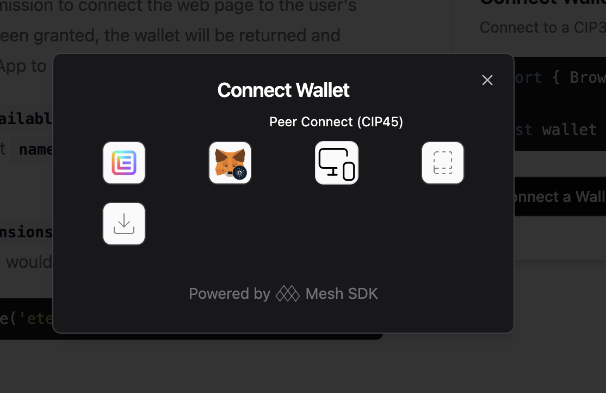
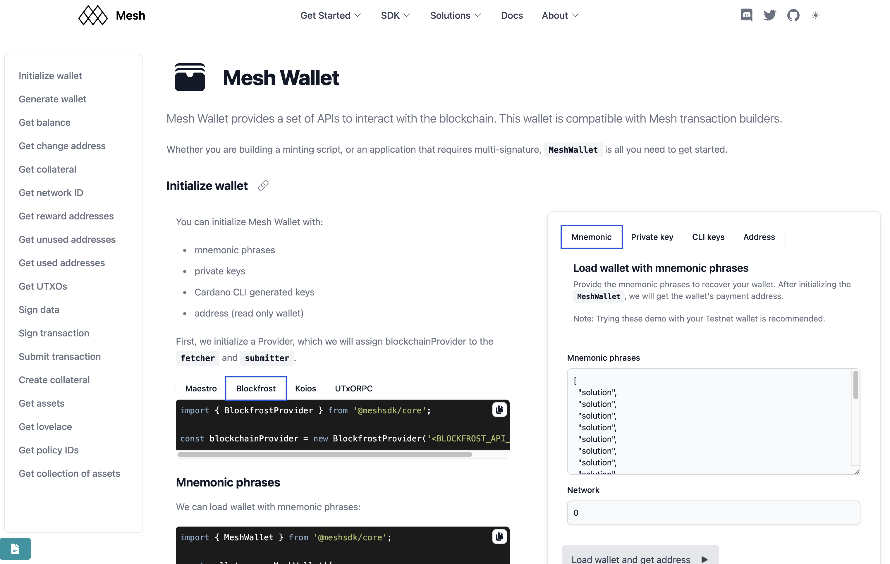

|Project ID|1200147|
|-----------|-------------|
|Link|[Open full project](https://projectcatalyst.io/funds/12/f12-cardano-open-developers/mesh-new-features-to-improve-developer-experience-and-cardano-adoption)|
|Milestone|[Milestone 2](https://milestones.projectcatalyst.io/projects/1200147/milestones/2)
|Challenge|F12: Cardano Open: Developers|
|Milestone Budget|ADA 30,000.00|
|Milestone Delivered|November 30, 2024|

We are glad to report on the successful completion of the second milestone of the proposal.

The Acceptance Criteria had been stated as:

- Finalised Mesh <> CIP 45: Set up dApp peer module
- Finalised Mesh Wallet: Finalise all wallet endpoints
- Finalised Mesh Wallet: Yaci support development
- All code licensed under open source licenses on the MeshJS github
  
And here the evidence of milestone completion.

## Finalised Mesh <> CIP 45: Set up dApp peer module

Here is a [demo](./assets/cip45.mov) of how CIP 45 works end-to-end using the latest React UI component.

## Finalised Mesh Wallet: Finalise all wallet endpoints

All endpoints can be found here: https://meshjs.dev/apis/wallets/meshwallet

## Finalised Mesh Wallet: Yaci support development

Mesh Wallet is fully compatible with Yaci node. All transactions (with custom protocol parameters) can be signed by Mesh Wallet:
https://meshjs.dev/yaci/transactions

## All code licensed under open source licenses on the MeshJS github

All code is hosted under the repositories at https://github.com/MeshJS/mesh/tree/main and https://github.com/MeshJS/mesh-saas , both with an active Apache 2.0 open source license, which can be found at:

- https://github.com/MeshJS/mesh?tab=Apache-2.0-1-ov-file#readme 
- https://github.com/MeshJS/mesh-saas?tab=Apache-2.0-1-ov-file#readme
- 
We hope our work and report finds you well and will be approved.

For any questions, feel free to reach out on:
- Email: hello@meshjs.dev
- Discord: https://discord.gg/hCbuZGwr2B 
